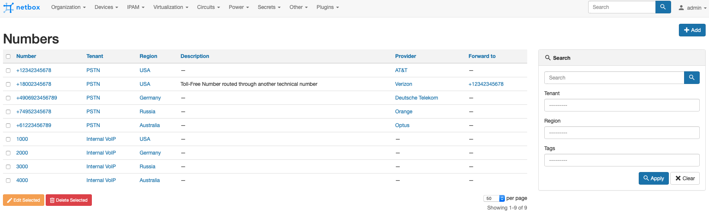

# PhoneBox Plugin

A Telephone Number Management Plugin for [NetBox](https://github.com/netbox-community/netbox).

>The plugin versions 0.0.1b1-0.0.1b4 support NetBox 2.10.x versions.
>
>Latest plugin version 0.0.1b5 supports NetBox 2.11.0+ versions

I described some general considerations behind the plugin development and future plans in my [blog post](https://idebugall.github.io/phonebox-init/).

### Preview




# Supported Features and Models

### Numbers

The plugin currently implements a Number abstraction representing a single telephone number of an arbitrary format.<br/>
A Number can consist of valid DTMF characters and leading plus sign for E.164 support:
  - leading plus ("+") sign (optional)
  - digits 0-9
  - characters A, B, C, D
  - pound sign ("#")
  - asterisk sign ("*")

Sample valid numbers: +12341234567, 1000, 123#2341234567, *100#.<br/>
Numbers are stored without delimiters. They will be implemented as an additional formatting function.<br/>
Number values can be not unique.
Tenant is a mandatory option representing a number partition. Number and Tenant are globally unique.<br/>
A Number can optionally be assigned with Provider and Region relations.<br/>
A Number can contain an optional Description.<br/>
A Number can optionally be tagged with Tags.<br/>
<br/>
The plugin supports Bulk Edit and Delete operations for Numbers.

### Plugin API

The plugin introduces a NetBox REST API extension `/api/plugins/phonebox/`.<br/>
It currently supports all create, read, update, and delete operations for Numbers via `/api/plugins/phonebox/numbers/`.<br/>
The API is compatible with [pynetbox](https://github.com/digitalocean/pynetbox):
```
>>> nb.plugins.phonebox.numbers.get(7)
2000
>>> 
```

# Installation

General installation steps and considerations follow the [official guidelines](https://netbox.readthedocs.io/en/stable/plugins/).

### Package Installation from PyPi

Assuming you use a Virtual Environment for Netbox:
```
$ source /opt/netbox/venv/bin/activate
(venv) $ pip3 install phonebox_plugin
```

### Package Installation from Source Code
The source code is available on [GitHub](https://github.com/iDebugAll/phonebox_plugin).<br/>
Download and install the package. Assuming you use a Virtual Environment for Netbox:
```
$ git clone https://github.com/iDebugAll/phonebox_plugin
$ cd phonebox_plugin
$ source /opt/netbox/venv/bin/activate
(venv) $ pip3 install .
```

To ensure NextBox UI plugin is automatically re-installed during future upgrades, create a file named `local_requirements.txt` (if not already existing) in the NetBox root directory (alongside `requirements.txt`) and list the `phonebox_plugin` package:

```no-highlight
# echo phonebox_plugin >> local_requirements.txt
```

### Enable the Plugin
In a global Netbox **configuration.py** configuration file, update or add PLUGINS parameter:
```python
PLUGINS = [
    'phonebox_plugin',
]
```

### Collect Static Files
The Plugin contains static files for topology visualization. They should be served directly by the HTTP frontend. In order to collect them from the package to the Netbox static root directory use the following command:
```
(venv) $ cd /opt/netbox/netbox/
(venv) $ python3 manage.py collectstatic
```

### Apply Database Migrations

Apply database migrations with Django `manage.py`:
```
(venv) $ python3 manage.py migrate
```

### Restart Netbox
Restart the WSGI service to apply changes:
```
sudo systemctl restart netbox
```

# Installation with Docker
The Plugin may be installed in a Netbox Docker deployment. 
The package contains a Dockerfile for [Netbox-Community Docker](https://github.com/netbox-community/netbox-docker) extension. Latest-LDAP version is used by default as a source.<br/>
Download the Plugin and build from source:
```
$ git clone https://github.com/iDebugAll/phonebox_plugin
$ cd phonebox_plugin
$ docker build -t netbox-custom .
```
Update a netbox image name in **docker-compose.yml** in a Netbox Community Docker project root:
```yaml
services:
  netbox: &netbox
    image: netbox-custom:latest
```
Update a **configuration.py**. It is stored in netbox-docker/configuration/ by default. Update or add PLUGINS parameter and PLUGINS_CONFIG parameter as described above.

Rebuild the running docker containers:
```
$ cd netbox-docker
$ docker-compose down
$ docker-compose up -d
```
Netbox Community Docker setup performs static files collection on every startup. No manual actions required.
